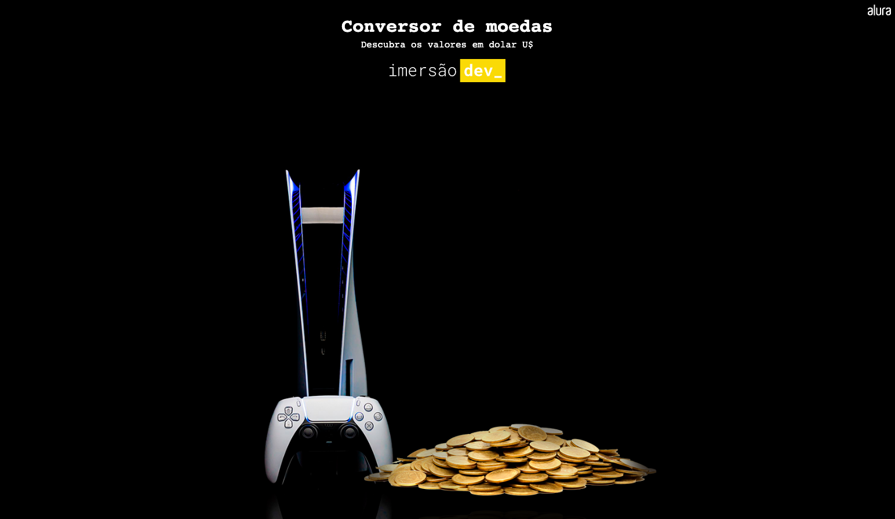
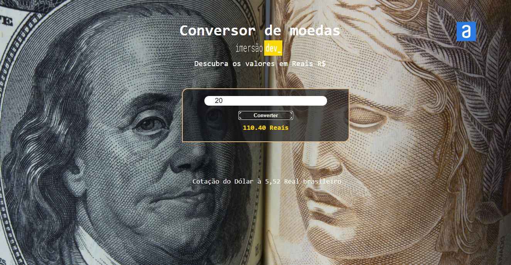

# 💵 Conversor de moedas
### 🪙 Currency converter 
 

📸 Screenshot

#  🚀 Technologies

- [HTML](##HTML)
- [CSS](##CSS)
- [JavaScript](##JavaScript)
- [Github](##github)
- [Codepen](##codepen)
- [VScode](##vscode)

# 👩🏻‍💻 Project 
Project made in immersion dev_ Alura's course of development for beginner

PT-BR: Projeto feito em curso imersão dev_ curso de desenvolvimento para iniciante da Alura 

📸 Screenshot

 # 
 
                        Feito com 🤍 by BM

 #### 🔎 **[Online project here](https://codepen.io/biancamos/pen/oNBxwxK)** Projeto desenvolvido em Agosto de 2022; na época a cotação do dólar estava entre 5,76 à 5,52.
 

